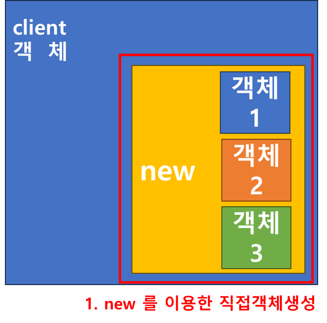
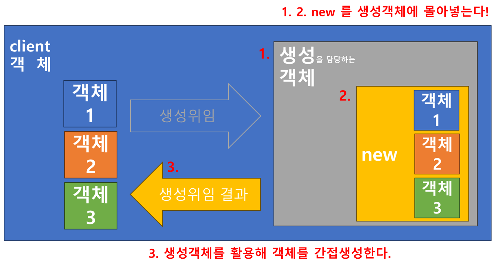
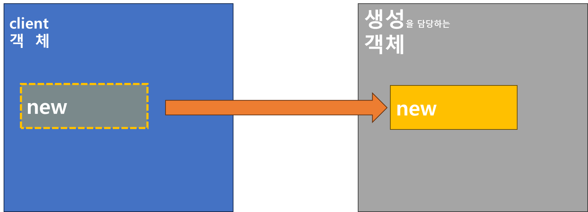
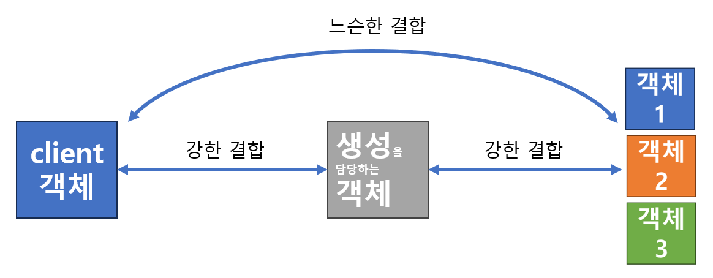

# Creational pattern(생성 패턴)
## 생성패턴의 의의
### 생성위임
- new를 이용하여 객체를 직접 생성하지 않는다!
    1. 직접생성 = new를 이용한 생성
    2. 간접생성 = new를 이용하지 않는 생성
        - 생성위임
            - "생성만을 담당하는 객체"가 모든 객체 생성을 맡는다.
                - "생성만을 담당하는 객체"에 new를 몰아 넣어, 이 객체가 모든 객체를 생성한다.
                - 함수의 반환이나 생성자등으로 생성된 객체를 전달한다.
        - 함수 반환값
        - 의존성 주입
    3. 직접생성, 간접생성 비교
        - 직접생성
        
        - 간접생성
        
        
- 느슨한 결합
    - client 객체가 객체1,2,3 을 직접생성(new 이용) 하였다면 client와 객체1,2,3은 강한 결합을 이룬다.
        - 강한 결합 : 생성객체 - 객체1,2,3
        - 느슨한 결합 : client 객체 - 객체1,2,3
        

